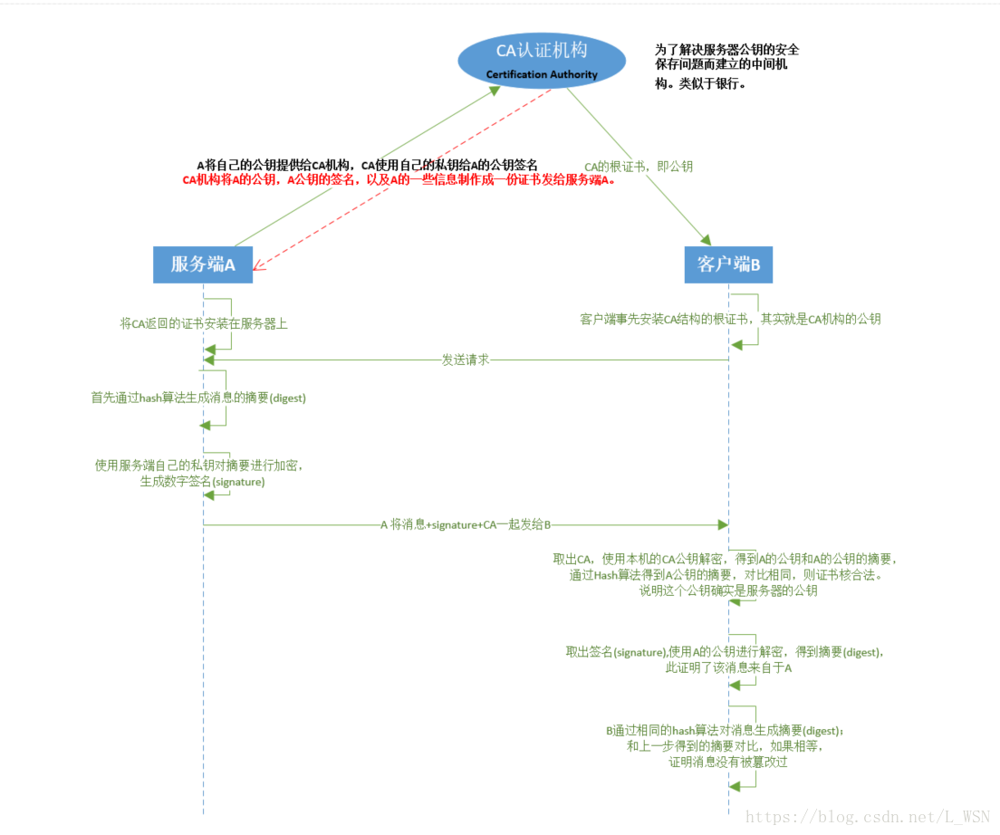

# HTTPS原理及双向数字验证

## 前言

​	一说到加密验证，就涉及到很多的名词与其对应的知识比如**对称、非对称加密、公钥、私钥、CA、数字证书、数字签名**，如果不先系统性地梳理一遍所涉及到的知识，就直接扎进去，很容易造成一次性摄取太多无系统性的知识而蒙圈，基本上是迷迷糊糊，似懂非懂，一说好像都听过，但是一问具体细节，却是答不上来。所以我们要先从整体大局上过一遍，了解大概知识结构，为什么要引入某一知识点，然后再一步步地逐个击破。

**场景引入**(文章有些逻辑可能说不现实)：

**无加密模式**：

我与女同学A在不同的地方上大学，一开始还只是朋友关系，我们通过书信来往，书信在投递传送过程中虽然有可能被别人截获偷看、被人篡改内容、甚至另外的人恶作剧伪装A同学给我写信，但是我们书信的内容也就是普通的寒暄，讲讲自己最近的生活之类，吐槽吐槽八卦之类的不重要内容，所以我们也都不在乎。

**对称加密模式**

后来我们感情升温，聊的火热，关系也比朋友更近了一步，信的内容也不再是简单的唠嗑了，所以为了不让比人能看到我们的信件内容，所以我们在回家过年的时候私底下讨论了一个对我们信件内容加密的方法，我们买同一版字典，先将信写好，然后逐字加密，加密方法就是找到该字在字典中的位置(第十页第一列第一位)，然后翻N页，然后取N页后的那一页的第一列第一位位置的字进行替换(当然这里对人工来说好像有些繁琐，工作量有点大，但是是为了展现场景，对于计算机来说，对于确定的算法，计算是非常快的)，解密方法就是找到那个字再往回翻提前商量好的页数，在找到对应坐标，即是原字(对于最后几页的字，再说吧，这里只是引入一下)。我们将写的信用该方法加密，收到的信用该解密方法解密，这样我们的信件内容就再也不怕被人截获和篡改伪装了。这里我们两方加密解密使用同一种算法即是对称加密。

**非对称加密**

本来这样好好的，但是有一天我不小心将我们加密的算法在跟朋友吹🐂的时候给说出去了，而我朋友里又有大嘴巴，那我这个加密算法可能要被非常多的人知道了，那么我跟A的信件内容又开始变的不安全起来，那我们把页数再换一下？但是这个新的页数在通信的过程中也有泄露的可能，我们又分居2地，无法私底下商量，还是得通过信件来传递该信息，于是我们又讨论了一个新的算法来加密我们的信件。

我们各自想一个自己的加密与其对应的解密算法出来，而且加密是必须通过对应的解密算法才能解读内容，其他方法不可解读。那我用明文写第一封信告诉你我的加密方式1，你收到后按照我的加密方式1加密你的回信2，告诉我你收到该加密方式了，并附带你的加密方式2在里面，我收到后用我的解密方式1来解密回信2，得到你的确认以及你的加密方式2，那么现在我们各自都拥有了对方的加密方式，但是解密方式都只有我们自己有，流传出去的可能泄露的也只是我们的加密方式，而解密方式并没有外传。那么现在，我们可以在信里放心讨论我们的感情话题了。

**非对称加密+对称加密**

但是写着写着我们发现，我既得用你的加密方法去加密，又得用我的解密方法去解密，这里就有2次的加解密过程，一次就够呛了，2次我们就可能工作量大增，没那么多耐心了。所以我们在交换完各自的加密方式之后，在这一情况下讨论一个对称加密方案，然后以后就使用这个对称加密方案对我们的信件内容加密。这样，我们的工作量就降低了，可以有更多时间写信来升温感情了。

所以好像看起来我使用非对称加密也有可能在吹牛的时候再一次泄密我的解密方法，导致通信变的不安全，那不是和对称加密一样了，有什么意义？首先，这里面存在的问题是 人的不可靠性，既然我们使用对称加密可能泄露加密方法，那么使用非对称加密，也可能泄露解密方法，人是不可靠的，这是个问题，但是这个问题不是对称/非对称加密所要解决的问题，他也解决不掉。

**非对称加密解决的问题**

对称加密那段，我们的前提是我跟A同学过年时私底下讨论了一种加密方法，但是现实情况不是这样的。我们随时可能和网络中的任何人进行http通信，即不存在提前讨论一种加密方法的情况。那么如何让我们的通信变的安全呢？即我们怎么跟别人"私底下"讨论出一个加密方案出来呢？这就是非对称加密所解决的问题，即**让通信变的“悄悄的”，就像我们私底下讨论一样，别人听不到。**

**为何引入证书**

有时候写着写着，我就在想，跟我再书信来往的，到底是不是真的我的女同学A啊？会不会是我哪个闲的没事干的舍友把我记在本子上的A同学的公钥加密方案给换了啊。换成他自己的公钥，然后又知道我的公钥，然后在背地里跟我瞎扯捉弄我，然后我就在信里旁敲侧击了几个只有我跟A同学才知道的秘密，他娘的，果然答不上来，呜呜呜呜，这么一想，我最开始第一次拿到A同学的公钥的时候，就可能已经不是A同学了，原来我一直在跟抠脚大汉写信。呜呜呜呜。那咋办嘛，**怎么确定发过来的公钥是A同学的呢**？而不是某个有恶趣味的抠脚大汉呢？嗯？

大家应该听说过网络上报道的各种奇葩证明，像“证明你妈是你妈”、"证明我孙子是我孙子"等等，就是让当事人去权威机构也就是公安局，让公安局写个"兹证明，xx是xx的母亲"的条子，再盖个公安局的公章，拿回去给业务人员看，再办业务。这里说这个就是为了指出这个逻辑：我不信你的话，但是我信公安局的公章，你拿着你的材料去公安局开个证明来，我就信你。

那我也一样，我对这个发过来的公钥不信任，咋办？那我告诉A同学去找个类似于公安局的第三方个人权威认证机构开个证明，证明你这个公钥就是你A同学的(够奇葩的😂)。我这边也收录这个权威机构的验证信息(CA公钥)，那你下次写信告诉我你的公钥的时候，把证书也放在里面。我查一下，证书确实真实可信，那么这个A同学的证书也就确实是A同学的了，于是我又可以开心地和A同学交流感情了。

引入证书这一阶段，涉及到了A同学，我，权威认证机构(CA)等三个角色，每个角色都拥有各自的公钥/私钥对整个过程如下

1. A同学，把自己个人信息，公钥发给CA机构

2. CA机构通过一定方式确认完A信息后，开始制作一份证书，证书包含同学A的公钥，同学A的信息、CA机构的信息，有效时间、证书序列号和一个数字签名。该数字签名的引入是为了保证以上的信息在传播过程中不被篡改，其产生过程为：将明文信息用hash进行散列得到摘要，然后用CA的私钥加密这个摘要，就得到数字签名。

3. A给我写信，携带她的信的内容、内容使用散列后再用A私钥加密得到的数字签名和CA机构颁发的证书

4. 我收到信要确认三点

   1. 首先确认证书是否为真实可信的。

      在公开渠道找CA机构的公钥，来解密证书内的数字签名得到证书内容的散列摘要1，然后再用相同的方法对证书内明文进行散列得到摘要2，对比摘要1和2，这些都完成了，说明证书为真，没有被篡改，那么其证明的A同学的摘要也是可信的了

   2. 消息确实来自A

      取出签名，使用A的公钥解密得到摘要，说明消息确实来自A同学

   3. 消息没被篡改。

      用相同的方法对消息内容进行散列，得到的散列与携带的相同，证明没被篡改过。

5. 

> 证书 = 申请者公钥 + 申请者/CA机构信息 + 数字签名

对称加密有什么痛点、引入非对称加密解决了什么问题？非对称加密又有什么痛点？

**数字签名** 和 **数字证书**

数字签名是为了保证消息在传递的过程中前后一致，不被篡改或丢失。那我消息跟数字签名一起改了，那不就看不出来了嘛？数字签名先是经过散列处理，再使用私钥进行加密，取到消息后拿对应的公钥解密得到摘要，再用同样的散列函数得到摘要进行比对，就可以确定有没有被篡改了。

## 涉及知识

1. 对称加密与非对称加密
2. HTTP
3. 证书逻辑

## What-什么是HTTPS

#### 什么是HTTP

说到HTTPS，还的先把HTTP说明白，HTTP即超文本传输协议(hyper text transport protocal),基于C/S架构，C一般为浏览器，S为服务器。用于在客户端与服务器之间传递数据。处于TCP/IP协议的应用层。为了降低耦合性，TCP/IP将整个过程分为4层

应用层：向用户提供应用服务时的通讯活动，包括ftp、http、dns

传输层：网络连接中2台计算机的数据传输，包括tcp、udp

网络层：处理网络中流动的数据包，通过怎样的传输路径把数据传给对方，包括ip、

数据链路层：硬件相关，网卡，路由器等等。

引入https是因为http的缺陷

1. 通信使用明文，内容可能被窃听
2. 不验证通信方的身份，可能遭遇伪装欺骗
3. 无法证明报文的完整性，可能遭到篡改

#### HTTPS

**HTTPS**比**HTTP**多了个**S**，这个**S**是**SSL**(Secure Socket Layer安全套接层)或者**TLS**(Transport Layer Security,传输层安全)，即在原HTTP的基础上加一层用于数据加密、解密、身份验证的安全层。即 `HTTP + 加密 + 认证 + 完整性保护 = HTTPS`

https的认证机制有2种：

双向认证：服务器与客户端都需要双向认证(常见于银行类网站，涉及到金钱相关)

单向认证：只需要验证服务端

### 对称、非对称加密

**对称加密**：加密与解密使用的是同一个密钥，优点是速度快，常见的有AES

**非对称加密**：加密解密使用不同的密钥，2个密钥形成有且仅有唯一的配对，即公钥、私钥，数据用公钥加密后须用私钥解密、用私钥加密后得用公钥解密。一般都保留私钥，给对方公钥(公钥一般不会单独出现，而是写进了证书里)，对方用我的公钥加密，我用私钥解密，我再使用对方的公钥加密，对方再使用其自己的私钥解密。缺点是慢，CPU开销大，常见非对称加密有RSA。

### 三关系、两概念

#### 三关系

客户端、服务端、CA(Certificate Authority,证书授权机构)机构的关系

在https通信中有三个角色。客户端、服务端、CA机构。

这里说下CA机构，作为电子商务交易中受信任的第三方，承担公钥体系中的合法性检验的责任。

#### 两概念

根证书与其他证书

网络关系中存在一个信任链条，根证书是信任链条的源头，是绝对安全且值得信任的，其他一级证书、二级证书由根证书来签名。

## Why-为什么要用HTTPS

## How-如何实现HTTPS

## When-何时使用HTTPS

## Where-在哪些地方使用HTTPS

## 双向认证

## Q&A

1. 双向认证一定要自建CA嘛？
2. 根证书、信任链条是啥？
3. 如果进行双向认证，那么服务端、客户端都需要准备哪些证书？
4. 双向认证中存在哪些角色？各自起到什么作用？

## 参考文章

* [扯一扯HTTPS单向认证、双向认证、抓包原理、反抓包策略](https://juejin.im/post/5c9cbf1df265da60f6731f0a)
* [自建CA实现HTTPS]([http://qimingyu.com/2017/04/28/%E8%87%AA%E5%BB%BACA%E5%AE%9E%E7%8E%B0HTTPS%E6%95%99%E7%A8%8B/](http://qimingyu.com/2017/04/28/自建CA实现HTTPS教程/))
* [非对称加密与HTTPS](https://zhuanlan.zhihu.com/p/37738632)
* [加签、验签、CA认证中心流程](https://blog.csdn.net/L_WSN/article/details/81068406)