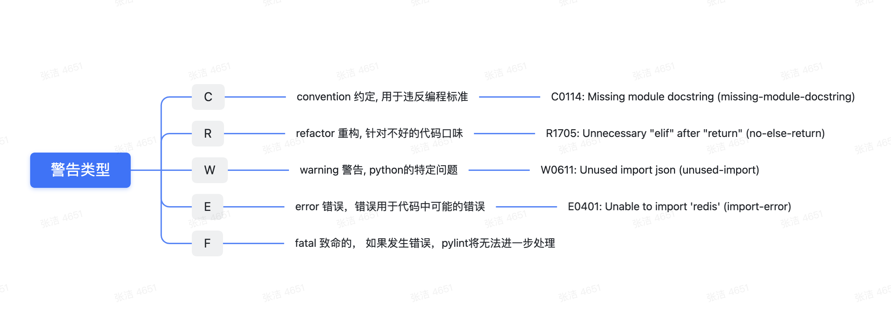
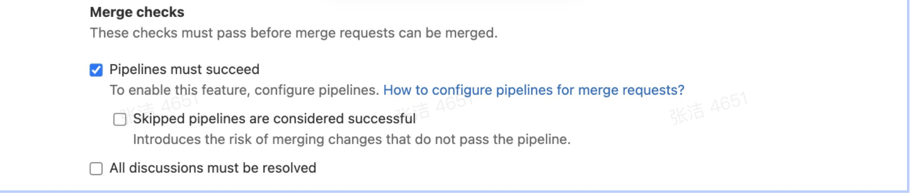

# Python代码检查工具Pylint在SDK工程中的应用

## 背景

由于业务代码的不规范编码导致的线上问题示例

1、有个不存在的错误函数引用在代码合并及仿真测试时未检查出来，导致线上重启失败

2、代码合并冲突时将部分代码冲掉，导致线上环境的部分依赖未有定义，会导致程序直接崩溃


以上示例，都是我们在研发过程中可能会粗心遗漏的情况，加上我们单元测试工作的不足，导致这类异常代码会被带到线上去，轻则只影响打点，重则影响登录支付业务。

所以我们需要工具来检查出代码中存在的问题，保证在上线前我们的代码是没有基础错误的，目前使用Python官方的静态检查工具pylint来完成这一操作.

经过测试使用验证，可以满足我们的需求，本文章记录pylint的基本使用和配合Gitlab CI来对我们的代码进行检查

## pylint基础使用

针对常用的场景来介绍基础用法和一些进阶用法

### 场景1：只检查部分文件

该场景适用于feature分支开发过程中的提交，针对每次提交的文件进行检查，不会进行全局检查

```
# 检查单个/多个文件
pylint 文件1 文件2 ... 文件n
```

### 场景2：检查整个工程

该场景适用于代码合并进入develop或者master，要进行上线前的检查，保证不会有错误代码合并上线

```
# 检查整个文件目录
pylint hall0-tygame-sdk-gamgo/src/tysdk
```

### 检查结果

pylint的执行结果包括每个模块的告警提示以及最终分数评估

```
************* Module design_patterns.channel_factory
qq.py:1:0: C0114: Missing module docstring (missing-module-docstring)
qq.py:15:4: W0231: __init__ method from base class 'JrttChannelLogin' is not called (super-init-not-called)
qq.py:36:8: R1705: Unnecessary "else" after "return" (no-else-return)
qq.py:8:0: E0611: No name 'wx' in module 'design_patterns' (no-name-in-module)

------------------------------------------------------------------
Your code has been rated at 8.84/10 (previous run: 3.73/10, +5.11)
```

**模块告警提示部分**

大概格式为

模块名：

文件名：行数：警告类型：警告详情(警告)



分数计算：

```
evaluation=10.0 - ((float(5 * error + warning + refactor + convention) / statement) * 10)
```

## pylint进阶使用

### 场景3：警告太多，只想关注Error级别的

如果不做限制，pylint会将4个级别的警告全部展示出来，假如我们是后期维护项目，不针对历史代码做代码风格及规范上面的更新，只为了保证更新的代码不会出现错误，那么我们可以通过以下设置来只展示Error级别警告

```
pylint --disable=C,W,R
```

以上操作会将C,W,R级别的警告全部禁用，而只保留Error

```
前
qq.py:1:0: C0114: Missing module docstring (missing-module-docstring)
qq.py:15:4: W0231: __init__ method from base class 'JrttChannelLogin' is not called (super-init-not-called)
qq.py:36:8: R1705: Unnecessary "else" after "return" (no-else-return)
qq.py:11:0: E0401: Unable to import 'make_sdk0' (import-error)

后
qq.py:11:0: E0401: Unable to import 'make_sdk0' (import-error)
```

### 场景4：部分文件比较老，想暂时忽略不关注

有部分历史文件可能已不再使用，就算有问题也不会修复，或者优先级不够高，等后续再解决

```
pylint --ignore=httppayv1.py,httppayv2.py
```

指定文件名即可，注意，后缀也需要，多个文件使用逗号隔开

### 场景5：老文件较多，想直接按文件夹来忽略检查项

针对场景4，如果需要忽略的文件较多，且在同一个文件夹/模块下，那我们可以设置忽略整个文件

```
pylint --ignore-patterns="dir/[\S+].py" src/ 
```

### 场景6：当前工程依赖于另一个外部工程，解决文件导入报错问题

例如SDK服务端是由账号支付业务工程和framework工程合并运行的，这就导致单独检查当前工程时，有framework的依赖，无法导入，那么在检查的时候可以通过以下设置来完成

```
pylint --init-hook='import sys;sys.path.append("/home/gitlab-runner/builds/gVhA_zos/0/freetime/hall0-freetime")'
```

该步骤将framework工程目录加入到检查路径下，则pylint在判断导入时，就不会产生报错

### 场景7：本地环境不同于测试线上pypy环境，忽略部分无法导入依赖类

例如账号支付业务工程内的twisted模块，本地可能无法导入，或者twisted模块内的部分类无法导入，那么此时需要忽略该部分导入报错，可以通过以下设置来完成

```
pylint --ignored-classes=twisted.internet.reactor,email.Header,email.Utils,email.MIMEText
```

该命令设置可忽略不检查的类名。

### 场景8：本地环境不同于测试环境，忽略部分无法导入模块

可通过以下命令来完成

```
pylint --ignored-modules=freetime6,tyframework,
```

### 场景9：工程文件太多，检查耗时较长，加快速度

整个工程文件较多，检查耗时较长，账号支付业务工程进行全局检查时，耗时接近9分钟，这速度有点慢，所以我们可以通过以下设置来加速

```
# Use multiple processes to speed up Pylint.
pylint --jobs=4
```

jobs默认使用1个进程来进行静态检查，可设置为4，加快速度, 跟机器核心数量匹配相等最佳，即4核心机器，设置为4即可

### 场景10：要加的限制太多，命令太长，指定配置文件

前面多个场景综合下来，整个命令非常长，我们可以将所有配置集合在一个配置文件里，pylint官方有默认的模板，我们按需修改，执行pylint时只需要指定配置文件即可，设置如下

```
pylint --rcfile=my_lint_cfg
```

示例配置文件如下：

[Pylint configuration | Codeac](https://www.codeac.io/documentation/pylint-configuration.html)

[examples/.pylintrc at master · kubeflow/examples](https://github.com/kubeflow/examples/blob/master/.pylintrc)

通过以上场景的设置，pylint执行后的结果已经基本达到我们想要的结果。接下来我们就要让其加入到我们的CI流程内，来工具化的保持代码质量

## Gitlab CI + pylint自动化检查

**1、.gitlab.yml文件内设置2个stage**

```

stages: 
  - code_check_push
  - code_check_merge

code_check_push:
  stage: code_check_push # 每次push都会检查当前提交的代码的规范错误，
  only:
    - pushes
  script:
    - chmod 755 my_pylint.sh
    - ./my_pylint.sh current
    - python pylint_check_score.py
    - rm pylintresult.log

code_check_merge:
  stage: code_check_merge
  only:
    - merge_requests 
  script:
    - chmod 755 my_pylint.sh
    - ./my_pylint.sh all
    - python pylint_check_score.py
    - rm pylintresult.log
```

code_check_push用于针对每次push到远程时进行代码检查，只检查本次提交的文件，只有检查通过才会打测试包。

code_check_merge用于针对每次发起merge-request到develop时进行代码检查，检查整个工程，只有检查通过才能合并进入develop分支

**2、具体执行脚本**

```
echo "开始pylint"

file_list="$1"
echo Pylint执行范围$file_list

if [ "$file_list" = "all" ];then
  echo 全局pylint
  pylint --rcfile=pylintrc src/tysdk 2>&1 | tee pylintresult.log
fi

if [ "$file_list" = "current" ];then
  echo 当前提交pylint
  # 获取git本次提交修改的文件列表
  changeFiles=$(git diff --name-only HEAD~ HEAD)
  echo 本次提交改动文件为:$changeFiles

  # 建一个用于存过滤py文件的新列表，正则过滤原列表，将py文件列表过滤出来
  new_files=()
  reg='.*\.py$'
  for file in $changeFiles;
  do
    if [[ "$file" =~ $reg ]];then
      new_files+=$file
      new_files+=" "
    fi
  done

  echo 过滤后需要pylint的文件:$new_files
  # 对过滤出来的py文件执行pylint操作
  echo $new_files  | xargs pylint --rcfile=pylintrc 2>&1 | tee pylintresult.log
fi
echo "pylint结束"
```

通过执行时设置的参数 all 和current来判断选择的检查的范围

**3、读取检查结果，判断分数，并通知到钉钉群内**

```
#  -*- coding: utf-8 -*-
'''
PyLint score checker. Returns 0 if the pylint score is greater than the one
specified below. This script allows us to use pylint normally with all the
standard paramaters.
'''
import urllib2
from re import findall
from sys import exit as sysexit

MIN_SCORE = 10.0
print "start checkout score..."

def post_inform(url="", content_text={}):
    url = "https://oapi.dingtalk.com/robot/send?access_token=xxx"
    data = '{"msgtype": "text","text": {"content":"本次提交代码Pylint分数低于标准值，请在CICD PIPLINES中确认代码中的问题"}}'
    handler = urllib2.HTTPHandler()
    opener = urllib2.build_opener(handler)
    req = urllib2.Request(url=url, data=data)
    req.add_header("Content-Type", 'application/json')
    try:
        connection = opener.open(req)
    except Exception as e:
        print e

with open('pylintresult.log') as plfh:
    score_line = plfh.readlines()[-2]
    rst = findall(r'([0-9\.]+)/10', score_line)
    if rst:
        score = float(rst[0])
    else:
        score =MIN_SCORE
    print "min score is ", MIN_SCORE
    print "this commit score is ", score
    if score < MIN_SCORE:
        post_inform()
    sysexit(0 if score >= MIN_SCORE else 1)

```

4、为了保证merge时只有检查通过才允许合并进入(默认情况为不通过也可以合并)，需要在gitlab后台内设置该项

Settings - General - Merge requests - Merge checks

勾选Piplines must succeed即可



## 建议

1、新启动的项目，要在一开始就设置好使用语言的静态代码检查工具，保证工程从一开始就是符合其语言规范的。

2、中途加入检查的项目，可以先从E级别开始检查，后续慢慢放开C,W,R级别，按需修改

## 参考文章

[gitlab merge-request piplines](https://docs.gitlab.com/ee/ci/pipelines/merge_request_pipelines.html)

https://stackoverflow.com/questions/17142236/how-do-i-make-pylint-recognize-twisted-and-ephem-members

https://jlshix.com/2020/11/06/gitlab-ci-automation/

[【Git】Git获取Commit修改文件列表_林多的博客-CSDN博客_git获取提交文件列表](https://blog.csdn.net/zxc024000/article/details/85160104)

https://github.com/PyCQA/pylint/issues/2242